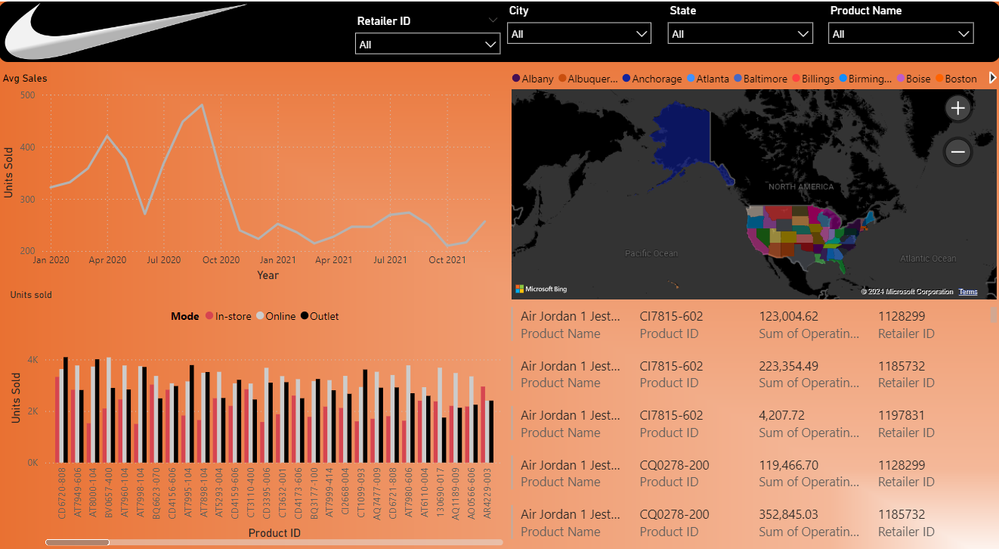

# Krishnavyas Desugari

## Education

**California State University, Long Beach  (_Long Beach, CA_)**                                  
- Master of Science in information systems(_May 2025_)
- Related Coursework:  AWS, SPSS, Business Analytics, Python, Django, Pandas, Machine learning, DBMS.

**Sree Vidyanikethan Engineering College (_Tirupati, India_)**                                                                                 
- Bachelor of Technology in Mechanical Engineering(_may 2022_)                                                                                               
- Related Coursework: Operations Management, C, Finite Element Analysis, Rapid Prototyping.

### Work Experiance
**Chegg, India | Subject Matter Expert**                                                                   
- Respond to 20 – 50 questions and requests for aid from students about Calculus and Advanced Math. 
- Help others understand concepts and solve questions, give thorough justifications, and step-by-step instructions. 
- Produce excellent written materials for calculus ideas and problems, such as explanations, tutorials, and solutions.
 
**BSCA Partners Ltd, India | Software Engineer Associate**                                                                  
- Spearheaded the creation of a React-based dashboard that shows data visually, improving stakeholders' understanding. 
- Actively supported senior developers by developing micro modules with modules with reusble methods.  
- Designed and Developed End-to-end and regression automation test flows.  
- Attained a prominent level of test execution productivity by consistently delivering a minimum of 15 test cases per week.  

**Internshala, India | Internshala Student Partner**                             
- Inform students about Internshala’s resources, programs, and services. 
- Organized workshops, information sessions and interview preparation. 
- Connected with academic staff and guidance counselors to establish relationships and work together to enhance student success.

### Projects
[**Budget and Expenses Tracker App | Python, Pandas**](https://github.com/krishnavyas36/Budget-Tracker-and-Analysis)                 
- Develop a user-friendly budget tracking app with CRUD operations using python and pandas. 
- Integrate Python and Excel to store data and make changes efficiently. 

[**Sports Arena Managment using DBMS | SQL**](https://drive.google.com/drive/u/1/folders/1OzFrEQ8d0IOvpYSUaQazzLdPgEezApgj)

[**System Analysis - urban Company care+**](https://drive.google.com/drive/u/1/folders/1oqWYW5x6s53zfPz03LiaLL5P1Qda2jhG)

[**Power BI Analysis: Nike USA Shoe sales | Power BI, Excel**](https://drive.google.com/file/d/1ELvBN9ASRtqZV5IR_PmY7iUUQZcwv37X/view?usp=drive_link)
- Implemented interactive features such as slicers, filters, and drill – through functionality to enable users to explore sales data.  
- Created visually appealing dashboards to visualize Nike sales trends over time and region.  
- Did a Comprehensive analysis of Nike data using Power Bi to give more insights to the users.

[Power BI Spotify Analysis](https://drive.google.com/file/d/1FiVRk6M69DaoHs8JLOyBxXeejcM1N6VU/view?usp=drive_link)
**YouTube Channels Performance Analysis | SPSS**                               
- Leveraged publicly available dataset to analyze factors influencing YouTube channel revenue and performance.  
- Conducted statistical analysis using SPSS software, running various simulations to identify key variables.  

[**Solving Bussiness problem with latest Information Systems(Twitter/X),2023**](https://drive.google.com/drive/u/1/folders/1-3MCs7x22sgpcMMvbakWq9KT3XVHmmy8)
- assessed immediate risks such as false information, technological failures, and unstable leadership
- comparing twitter/X to competitors using Porter's Five Forces model
- establiseed goals for various indicators, such as consumption, attrition rate, and uptime

[**YouTube Channel Performance Analysis Project,2023**](https://drive.google.com/drive/u/1/folders/1-80CHnszlGmA7WXSpboFkAH8iAkZj8RR)
- Leveraged publicly available Kaggle dataset to analyze factors influencing YouTube channel revenue and performance.
- Employed extensive data cleaning techniques to ensure data integrity and accuracy.
- Conducted comprehensive statistical analysis using SPSS software, running various simulations to identify key variables.

[**Contacts app | Python, Django, HTML**](https://github.com/krishnavyas36/krishnavyas_desugari01)                 
- Created a user- friendly Contacts Management application with an easy-to-use interference.  
- Implement CRUD operations for managing contacts effectively.

[**Finding WEDM Parameters of a Metal and optimizing it by Using Taguchi method-based approach, 2022**](https://drive.google.com/drive/u/1/folders/1c3jFDvADExxtOc-K4UPqD1hAe1CIKNu1)
- The Taguchi technique is used to determine and optimize important WEDM Parameters
- Examined how the optimized parameters might be used to actual cutting applications.
- Boost productivity and cut down on waste when cutting metal

###Certifications

- Programming for Everybody (Getting Started with Python)[Link](https://coursera.org/share/e63f2795f16522da33cf91bbc5d96f0c)
- Python Data Structures[Link](https://coursera.org/share/f6de3489c05f5068a360396dc139a694)
- Python:working with files[Link](https://www.linkedin.com/learning/certificates/27d104394e0ee60d3741a1a8a55ee8059fe2f4f99d724fc1303f5ea011f603be?u=42458916)
- Machine Learning for All[Link](https://coursera.org/share/f289cc6e887d947d2659a9dc3a25b0d5)
- Unsupervised Machine Learning for Customer Market Segmentation[Link](https://coursera.org/share/039fe5f1aea6fa9e054bd33a8f8b551e)
- Excel Fundamentals for Data Analysis[Link](https://coursera.org/share/390476a38d9387ca66bd6a95716291d8)
- Strategic Business Management - Macroeconomics[Link](https://krishnavyas36.github.io/account/accomplishments/?utm_source=link&utm_medium=certificate&utm_content=cert_image&utm_campaign=pdf_header_button&utm_product=course)
- predective Analytics Essential Training: Data Mining[Link](https://www.linkedin.com/learning/certificates/d762c898feca6637689d03f4139ca23c1af913f37f51fd221e582375d99faa65)
- Building Digital Media using Graphic Design in Google Slides[Link](https://coursera.org/share/38b887a53f4fc4ea763b54c578cd6b30)
- Introduction to Mechanical Engineering Design and Manufacturing with Fusion 360[Link]
